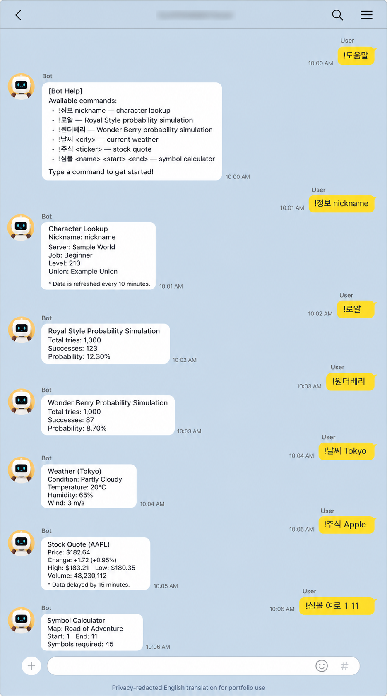

# Kakao Maple Bot

> A personal project that connects KakaoTalk on a spare Android phone to an AWS serverless backend, automating recurring lookups and calculations for a real group chat.

[한국어](README.md) · [日本語](README.ja.md)

`TypeScript` · `AWS Lambda` · `API Gateway` · `DynamoDB` · `Terraform` · `Nexon Open API` · `Vitest`

## Technical summary in 30 seconds

KakaoTalk is the **user interface**, not the architectural center. The system keeps Android as a thin HTTPS relay and places authentication, validation, command routing, provider-failure isolation, caching, and observability in a messenger-independent serverless backend. Changes follow `Issue → PR → CI → advisory AI review → verification record`, with repository, AWS, and user-device evidence reported separately.

- **Boundary design:** HTTP contract between a legacy Android runtime and TypeScript domain logic
- **Reliability:** per-provider timeout, cache, retry, stale fallback, and partial-failure handling
- **Security/operations:** deny-by-default rooms, Bearer authentication, least-privilege IaC, no personal-message storage
- **Quality:** strict TypeScript, 186 tests, and automated policy, secret, build, and Lambda dry-run checks

## At a glance

| Item          | Details                                                                                           |
| ------------- | ------------------------------------------------------------------------------------------------- |
| Development   | August 2026–present                                                                               |
| Type          | Personal, non-commercial portfolio project in active use                                          |
| Scope         | Requirements, architecture, TypeScript implementation, IaC, tests, AWS deployment, and operations |
| Users         | A limited KakaoTalk group of the developer and consenting acquaintances                           |
| Current state | Deployed in Tokyo; backend smoke tests completed                                                  |
| Quality       | 186 automated tests, strict typecheck, lint, policy and phone-script checks                       |

The main engineering question was not simply how many commands could be added, but **how to isolate the risks of an unofficial messenger integration and operate it with verifiable evidence**. AI-assisted development tools were used; changes are checked against official documentation, code review, automated tests, and post-deployment smoke tests.

## Problem and approach

MapleStory players repeatedly move between character sites, symbol calculators, boss-income tables, and event pages. Group chats also contain small decisions—food, games, and recommendations—that benefit from immediate answers.

- One short KakaoTalk command returns the essential result.
- The Android device remains a thin relay; business logic and secrets stay in AWS.
- MapleStory data comes from the Nexon Open API, while calculations use versioned project-owned logic.
- Provider-specific timeouts, caches, retries, and stale fallbacks isolate failures.
- Message text, room names, and sender identities are not stored; only an anonymous aggregate count is retained.

## Architecture

```text
KakaoTalk
    ↕ Android notification / reply
MessengerBot R v40 on a spare phone
    ↕ HTTPS + Bearer secret
Amazon API Gateway HTTP API
    ↓
AWS Lambda (Node.js 22 / TypeScript)
    ├─ authentication, allowed rooms, rate limits, event deduplication
    ├─ command router / formatter
    ├─ Nexon Open API adapter
    ├─ read-only provider adapters
    ├─ calculators / static data / random features
    └─ anonymous counter ─ DynamoDB (Tokyo)
```

Keeping the phone script thin preserves the HTTP contract and backend logic when the device changes. Calculations, provider calls, caching, and authentication can be tested without a phone. See the [architecture](docs/03-architecture.md) and [ADRs](docs/decisions/README.md).

## Engineering highlights

### Clear external-service boundaries

- Character, dojo, union, equipment, and experience data use the Nexon Open API.
- Maple.GG and Maplescouter are link-only destinations; the bot does not crawl them or use private APIs.
- Symbol and boss-income calculations use sourced, date-versioned static data and pure functions.

### Calculator without code evaluation

The bot accepts game-native Korean input such as `!계산기 25.3억 2명 5퍼`. A dedicated tokenizer and recursive-descent parser handles arithmetic, units, fees, and equal splits without `eval` or `Function`.

### Failure isolation and mobile output

- Timeouts, caches, and retries are isolated per provider.
- A permitted recent-success fallback covers temporary public-board failures; access controls are never bypassed.
- Long equipment responses retain the data and are split by the phone relay for KakaoTalk.

### Security and privacy by default

- Deny-by-default rooms, a Bearer secret, kill switch, rate limits, and event-ID TTL are enforced.
- API keys, shared secrets, and real room names are injected outside Git.
- CloudWatch records command type, outcome, and latency—not message text or user identity.
- `!통계` updates only one aggregate DynamoDB `TOTAL` item.

### Reproducible AWS operations

The initial Cloudflare Worker design was migrated to Lambda and API Gateway to build hands-on AWS operations, IAM, and IaC experience. Terraform restricts deployment to Tokyo and manages least-privilege IAM, encrypted DynamoDB, and Lambda configuration.

## Representative features

| Area                 | Example                                           | Engineering focus                                     |
| -------------------- | ------------------------------------------------- | ----------------------------------------------------- |
| Character data       | `!정보 nickname`, `!장비 nickname`                | Schema validation, partial failure, mobile formatting |
| Progress calculators | `!심볼 기어드락 1 11`, `!사우나 nickname`         | Versioned data and boundary tests                     |
| Boss income          | `!보스수익 검마 하드 2인 / 세렌 노말 3인`         | Weekly/monthly rules, party validation, flooring      |
| General calculator   | `!계산기 12퍼 x 11개`                             | Dedicated parser with no code evaluation              |
| Notices and events   | `!공지`, `!이벤트`, `!썬데이`                     | Official data, caching, keyword alerts                |
| PC/Danawa lookup     | `!다나와견적`, `!다나와최저가`, `!다나와가격비교` | MCP tools through an authenticated ECS adapter        |
| Utility data         | `!날씨 도쿄`, `!환율`, `!주유소 서울`             | Read-only providers and error isolation               |
| Chat utilities       | `!짜장vs짬뽕`, `!뭐먹지`, `!로또`                 | Pure local logic                                      |
| Stocks               | `!주식 삼성전자`, `!주식 Tesla`                   | Read-only data; no orders or account access           |

The complete input and error contract is in the [command specification](docs/04-command-specification.md).

## From user feedback to a feature

On 2026-09-01, a user in a restricted chat room asked for “computer build recommendations by price range.” The expected experience was similar to Danawa PC's budget-based recommendations: show a parts list and estimated total directly in KakaoTalk rather than returning only a link. This feedback led to `!견적 <budget> <use case> [include monitor]`, up to three candidates, and an isolated PC-price adapter boundary. Participant names, room identifiers, and the original conversation image are not stored; only the requirement and verification decision are documented. See the [troubleshooting record](docs/13-troubleshooting.md).

## Verifiable results

| Check             | Observed result                                         | Evidence                                               |
| ----------------- | ------------------------------------------------------- | ------------------------------------------------------ |
| Automated tests   | **186 passed** (`core 66`, `providers 51`, `lambda 69`) | `pnpm test`                                            |
| Static quality    | strict typecheck, ESLint, Prettier, policy check        | [Verification record](docs/10-local-verification.md)   |
| Phone relay       | MessengerBot R JavaScript syntax check                  | `pnpm phone:check`                                     |
| AWS deployment    | Tokyo Lambda/API Gateway, `/health` HTTP 200            | [Release gate](docs/12-release-gate.md)                |
| Authenticated API | Help and boss-income responses from `/v1/messages`      | [Verification record](docs/10-local-verification.md)   |
| KakaoTalk use     | In use in a limited group chat                          | User-confirmed; Android E2E not independently observed |

A healthy `/health` endpoint is not presented as proof of the complete KakaoTalk path. Repository checks, AWS-observed results, and user-device confirmation are documented separately.

## Development and review flow

Each new change starts with an Issue that defines the problem and acceptance criteria, then proceeds through a focused branch and a PR containing `Closes #N`. Deterministic GitHub Actions checks are the merge gate; CodeRabbit's Japanese review is advisory and helps surface omissions and boundary cases. The author verifies each AI comment and records why it was accepted, adapted, or rejected.

See [Issue, PR, and review workflow](docs/21-development-workflow.md) for branch protection and evidence layers, and [troubleshooting](docs/13-troubleshooting.md) for observed failures and verification limits.

## Usage evidence

<p align="center">
  
</p>

This is a privacy-safe translated presentation asset, not authoritative OCR or primary evidence of deployment. See the [evidence and publication policy](docs/17-portfolio-evidence.md).

## Technology

| Area           | Stack                                                                                  |
| -------------- | -------------------------------------------------------------------------------------- |
| Backend        | TypeScript 5, Node.js 22, AWS Lambda                                                   |
| API / State    | API Gateway HTTP API, DynamoDB                                                         |
| Infrastructure | Terraform, CloudFormation, IAM Identity Center                                         |
| External data  | Nexon Open API, Open-Meteo, TMDB, Yahoo Finance, Tiingo, and other read-only providers |
| Quality        | Vitest, TypeScript strict, ESLint, Prettier, dependency audit, policy check            |
| Device relay   | MessengerBot R v40, JavaScript                                                         |

## Repository layout

```text
apps/lambda/         AWS Lambda HTTP boundary
apps/phone-relay/    MessengerBot R thin relay
packages/core/       command, parser, calculator, formatter
packages/providers/  external API adapters and schemas
infra/terraform/     AWS infrastructure as code
tests/               unit, provider-contract, Lambda-integration tests
docs/                requirements, architecture, policy, operations, evidence
```

## Local verification

Node.js 22 and pnpm 11 are expected. Mock-based tests run without real API keys.

```powershell
pnpm install --ignore-scripts
pnpm typecheck
pnpm test
pnpm lint
pnpm build
pnpm lambda:dry-run
pnpm format:check
pnpm policy:check
pnpm phone:check
pnpm audit
```

[.env.example](.env.example) contains empty variable names only. Allowed rooms also default to empty, so the bot does not respond until explicitly configured.

AWS deployment requires explicit approval and valid IAM Identity Center authentication. See the [Terraform operations guide](infra/terraform/README.md) and [release gate](docs/12-release-gate.md).

## Documentation

- [Product requirements](docs/01-product-requirements.md) · [Functional and non-functional requirements](docs/02-requirements.md)
- [Architecture](docs/03-architecture.md) · [Command contract](docs/04-command-specification.md)
- [API and data policy](docs/05-api-data-policy.md) · [Security and operations](docs/06-security-operations.md)
- [Test strategy](docs/07-test-strategy.md) · [Troubleshooting](docs/13-troubleshooting.md)
- [Development and review workflow](docs/21-development-workflow.md) · [Change log](docs/14-change-log.md)
- [Phone E2E checklist](docs/16-phone-e2e-checklist.md) · [Portfolio evidence policy](docs/17-portfolio-evidence.md)

## Limitations

- Automating a regular KakaoTalk account is not an official chatbot path and carries account-restriction risk.
- Free Tier does not guarantee a zero bill; AWS Budgets and usage monitoring are still required.
- Providers based on public HTML can fail when page structure or access policy changes.
- An independent 24-hour Android soak test and reboot/network-recovery test remain pending.
- Stock output is informational only; there is no trading, recommendation, or return guarantee.

## License

No license has been granted. This repository is published as a personal, non-commercial portfolio and does not grant permission to copy, redistribute, or use it commercially.
