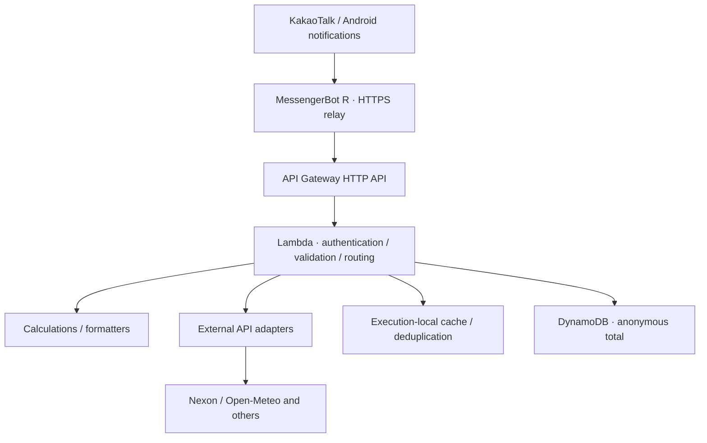

# Kakao Maple Bot

[日本語](README.ja.md) · [한국어](README.md)

[](https://github.com/ekseh93/kakao-maple-bot/actions/workflows/checks.yml)

> A personal AWS serverless chatbot that automates group-chat lookups and calculations, with improvements driven by user feedback.

`TypeScript` · `AWS Lambda` · `API Gateway` · `DynamoDB` · `Terraform` · `Vitest` · `GitHub Actions`

## Start here

An Android phone relays commands over HTTPS and splits long responses. The backend validates requests, routes commands, calls external APIs, and calculates results. Group-chat use is user-confirmed; independent reboot, network-recovery, and 24-hour device tests remain open.

Development uses AI assistance. Requirements and operating decisions, generated code, review findings, and executed checks are distinct evidence. This repository does not claim unaided implementation of all code or professional team-development experience.

Read the [three engineering case studies (Japanese)](docs/22-engineering-case-studies.ja.md), [actual review and fixes in PR #9](https://github.com/ekseh93/kakao-maple-bot/pull/9), and [verification scope](docs/23-portfolio-verification.md).

## Architecture



- External API keys stay in the backend. The phone still needs a backend-authentication secret, kept outside Git.
- Caches, rate-limit buckets, and event deduplication use Lambda execution-local memory. They are neither durable nor shared across instances.
- DynamoDB retains an anonymous counter and update time, not conversations or user identities.
- Core logic can be tested without a phone. Porting to another messenger has not been verified.

[Architecture details](docs/03-architecture.md) · [ADRs](docs/decisions/README.md)

## Engineering decisions

| Problem                                       | Decision                                                                      | Evidence                                                                                             |
| --------------------------------------------- | ----------------------------------------------------------------------------- | ---------------------------------------------------------------------------------------------------- |
| Air-quality failures suppress useful weather  | Treat air quality as optional; apply a 1.2-second budget through body parsing | [Provider](packages/providers/src/index.ts), [regressions](tests/providers.test.ts)                  |
| User arithmetic must not execute code         | Dedicated tokenizer and recursive-descent parser                              | [Calculator](packages/core/src/calculator.ts)                                                        |
| Secret scanning rejects safe examples         | Distinguish placeholders/references and redact finding values                 | [Scanner](scripts/secret-check-core.mjs), [PR #9](https://github.com/ekseh93/kakao-maple-bot/pull/9) |
| Long equipment output is unreadable on mobile | Preserve backend results and split messages at the relay                      | [Phone script](apps/phone-relay/bot.js)                                                              |

## Change management

`Issue → short-lived branch → PR → CI / CodeRabbit → reviewed fixes → main`

Quality, security, and test/build checks run independently. The final `verify` gate succeeds only when every suite succeeds. Japanese CodeRabbit reviews are advisory; accepted and rejected findings need reasons.

[PR #9](https://github.com/ekseh93/kakao-maple-bot/pull/9) demonstrates real review responses and regression fixes. Subsequent work accumulated on a branch with failing CI; [Issue #10](https://github.com/ekseh93/kakao-maple-bot/issues/10) reconciles that work and improves the process. Earlier changes are not retroactively presented as having followed this workflow.

[Workflow](docs/21-development-workflow.md) · [Troubleshooting](docs/13-troubleshooting.md) · [Change log](docs/14-change-log.md)

## Features and evidence

| Area             | Examples                                     | Focus                                        |
| ---------------- | -------------------------------------------- | -------------------------------------------- |
| Character data   | `!정보 nickname`, `!장비 nickname`           | Official API, validation, aggregation        |
| Calculations     | `!계산기 25.3억 2명 5퍼`, `!사우나 nickname` | Units, fees, boundary cases                  |
| Utilities        | `!날씨 도쿄`, `!환율`, `!주유소 서울`        | Caching, timeouts, partial failure           |
| Events and draws | `!썬데이`, `!시드링`, `!부티크`              | Notification state, probability tables       |
| PC lookups       | `!다나와견적`                                | Authenticated adapter/process boundary       |
| Operations       | `!통계`, `!상태`                             | Administrator restrictions, anonymous totals |

[Full command contract](docs/04-command-specification.md)


The image is an edited presentation asset, not primary evidence of exact API output. [Publication policy](docs/17-portfolio-evidence.md)

[Verification records](docs/23-portfolio-verification.md) distinguish local checks, historical AWS observations, and user-device confirmation. Performance targets are not measured achievements. Merging a PR does not deploy it; deployment requires separate approval and recorded observations.

## Local checks

Use Node.js 22 and pnpm 11.19.0. Tests use fixtures without real API credentials.

```sh
pnpm install --frozen-lockfile --ignore-scripts
pnpm format:check
pnpm lint
pnpm phone:check
pnpm pc-deals:check
pnpm policy:check
pnpm secret:test
pnpm secret:check
pnpm audit
pnpm typecheck
pnpm test
pnpm lambda:dry-run
```

[Configuration names](.env.example) · [Terraform guide](infra/terraform/README.md) · [Test strategy](docs/07-test-strategy.md)

## Constraints

- Personal, non-commercial project. The ordinary-account relay is not an official Kakao chatbot integration and depends on device/account behavior.
- Free tiers do not guarantee a zero bill. No commercial SLA or cross-instance deduplication guarantee is claimed.
- Public-HTML providers can fail after structure or access-policy changes. Maple.GG and Maplescouter are link-only.
- Stock features are read-only; no trades or return guarantees.
- No license has been granted. Publication does not grant redistribution or commercial-use rights.
