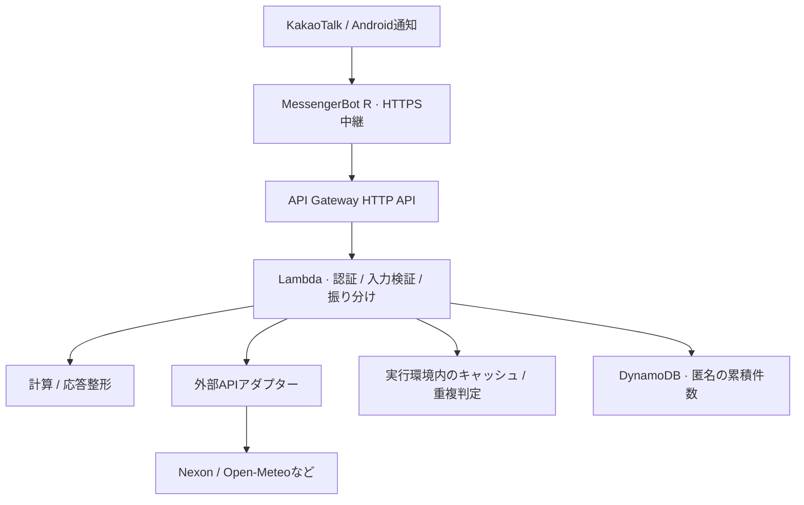

# Kakao Maple Bot

[한국어](README.md) · [English](README.en.md)

[](https://github.com/ekseh93/kakao-maple-bot/actions/workflows/checks.yml)

> 利用者のフィードバックをもとに、グループチャットでの情報検索・計算を改善してきたAWSサーバーレスの個人プロジェクトです。

`TypeScript` · `AWS Lambda` · `API Gateway` · `DynamoDB` · `Terraform` · `Vitest` · `GitHub Actions`

## 採用担当の方へ

KakaoTalkは韓国で使われるメッセンジャーです。本プロジェクトでは、Android端末が受信したコマンドをHTTPSでバックエンドへ送り、検索・計算結果を同じチャットに返します。ゲーム固有の知識がなくても、認証、外部APIの障害対応、テスト、変更管理の設計を確認できます。

開発にはAI支援ツールを使用しています。要件と運用上の判断、AIが生成したコード、レビュー内容、実行した検証を区別して記録します。全コードをAIなしで独力実装した実績や、チーム開発の職歴を示すものではありません。

まずは[技術事例3件](docs/22-engineering-case-studies.ja.md)、[実際のレビュー・修正PR #9](https://github.com/ekseh93/kakao-maple-bot/pull/9)、[検証範囲](docs/23-portfolio-verification.md)をご覧ください。

[匿名統計の合成サンプルを表示](docs/assets/command-usage-sample.svg)

この図は実運用データではなく、固定したポートフォリオ用サンプルです。集計項目と個人情報の扱いは[統計資料](docs/portfolio/command-usage.md)をご覧ください。

## 構成



Android端末を中継処理に限定し、業務ロジックをHTTP APIの先に分離しています。別のメッセンジャーへの移植は未検証ですが、計算や外部API処理は端末なしでテストできます。

- 外部サービスのAPIキーはバックエンドで管理します。端末にはバックエンド認証用の共有シークレットだけを設定し、Gitには保存しません。
- キャッシュ、重複判定、アクセス頻度制限はLambda実行環境内のメモリを使用します。再起動後の保持や複数インスタンス間の共有は保証しません。
- DynamoDBには匿名の累積件数と更新時刻を保存します。会話本文や利用者名を保存する仕組みではありません。

[詳細設計](docs/03-architecture.md) · [設計判断の記録](docs/decisions/README.md)

## 技術的な判断と根拠

| 課題                                   | 判断                                                     | 確認できる資料                                                                                          |
| -------------------------------------- | -------------------------------------------------------- | ------------------------------------------------------------------------------------------------------- |
| 大気質APIの障害で天気全体が返せない    | 大気質を任意項目にし、本文取得まで1.2秒で制限する        | [実装](packages/providers/src/index.ts)・[回帰テスト](tests/providers.test.ts)                          |
| 利用者の計算式を安全に処理したい       | コード評価を使わず、字句解析と再帰下降構文解析で計算する | [計算機](packages/core/src/calculator.ts)                                                               |
| 秘密情報の検査が安全な例示まで検出する | 例示値と設定参照を区別し、検出値そのものはログに出さない | [検査コード](scripts/secret-check-core.mjs)・[PR #9](https://github.com/ekseh93/kakao-maple-bot/pull/9) |
| 長い結果がスマートフォンで読みにくい   | 装備情報は保持し、端末側でメッセージを分割する           | [中継スクリプト](apps/phone-relay/bot.js)                                                               |

## 変更管理とレビュー

`Issue → 作業ブランチ → PR → CI / CodeRabbit → 指摘の検討・修正 → main`

品質、セキュリティ、テスト・ビルドの検査を並列で実行し、すべて成功した場合だけ最終チェックの `verify` を通します。CodeRabbitの日本語レビューは補助として使い、指摘の採用・修正・不採用の理由を記録します。

[PR #9](https://github.com/ekseh93/kakao-maple-bot/pull/9)では、秘密情報検査の不備やCI説明の不一致を修正し、回帰テストを追加しました。その後の変更でCI失敗とブランチへの変更蓄積が発生したため、[Issue #10](https://github.com/ekseh93/kakao-maple-bot/issues/10)で統合と運用改善を進めています。過去の作業がすべてこの手順で行われたとは説明しません。

[運用ルール](docs/21-development-workflow.md) · [障害記録](docs/13-troubleshooting.md) · [変更履歴](docs/14-change-log.md)

## 利用と検証

限定的なグループチャットでの使用は利用者から確認されています。端末の再起動、通信断からの復旧、24時間の継続試験は別途確認が必要です。


画像は編集・翻訳した説明資料です。実際のAPI出力を証明する一次資料ではありません。[画像の扱い](docs/17-portfolio-evidence.md)

テスト結果は対象版と一緒に[検証記録](docs/23-portfolio-verification.md)へ記載します。リポジトリの検査、過去のAWS確認、利用者の端末確認を区別し、未測定の応答速度や稼働率を実績として表示しません。PRのマージと本番へのデプロイも別の作業です。

## 代表的な機能

| 用途           | コマンド例                                     | 技術的な観点                           |
| -------------- | ---------------------------------------------- | -------------------------------------- |
| ゲーム情報     | `!정보 キャラクター名`、`!장비 キャラクター名` | 公式API、応答検証、数値集計            |
| 計算           | `!계산기 25.3억 2명 5퍼`                       | 単位、手数料、均等分配の処理           |
| 生活情報       | `!날씨 도쿄`、`!환율`                          | キャッシュ、時間制限、部分失敗         |
| お知らせ・抽選 | `!썬데이`、`!시드링`                           | 重複通知の制御、確率表の解釈           |
| PC情報         | `!다나와견적`                                  | 認証済みアダプターと外部プロセスの分離 |
| 運用           | `!통계`、`!상태`                               | 管理者制限、匿名集計                   |

全コマンドは[コマンド仕様](docs/04-command-specification.md)にあります。開発・運用資料の一部は韓国語です。

## 手元での検証

Node.js 22、pnpm 11.19.0を使用します。実APIキーなしで固定データを使ったテストを実行できます。

```sh
pnpm install --frozen-lockfile --ignore-scripts
pnpm format:check
pnpm lint
pnpm phone:check
pnpm pc-deals:check
pnpm policy:check
pnpm secret:test
pnpm secret:check
pnpm audit
pnpm typecheck
pnpm test
pnpm lambda:dry-run
```

[設定項目](.env.example) · [Terraform運用](infra/terraform/README.md) · [テスト方針](docs/07-test-strategy.md)

## 制約

- 個人・非商用プロジェクトです。一般アカウントの中継は公式Kakaoチャットボット連携ではなく、アカウントや端末の制約を受けます。
- 無料枠は請求額0円を保証しません。商用SLAや分散環境での重複排除を保証するものではありません。
- 公開HTMLを扱う機能は構造変更・アクセス制限で失敗します。Maple.GGとMaplescouterはリンク表示のみです。
- 株価は参照専用で、売買や利益保証は行いません。
- ライセンスは付与していません。公開は再配布・商用利用の許諾を意味しません。
