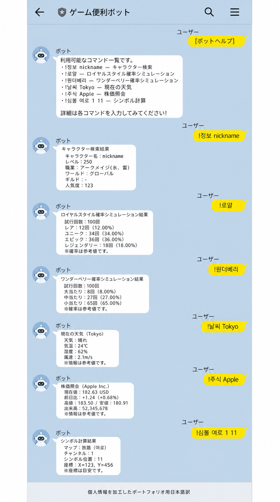

# Kakao Maple Bot

> 予備のAndroid端末上のKakaoTalkとAWSサーバーレスバックエンドを接続し、グループチャットで繰り返し発生する情報検索と計算を自動化した個人プロジェクトです。

[한국어](README.md) · [English](README.en.md)

`TypeScript` · `AWS Lambda` · `API Gateway` · `DynamoDB` · `Terraform` · `Nexon Open API` · `Vitest`

## 30秒で分かる技術要点

KakaoTalkはこのシステムの**ユーザーインターフェース**であり、技術的な中心は特定messengerに依存しないserverless backendです。Androidを薄いHTTPS relayに限定し、認証、入力検証、command routing、外部API障害の局所化、cache、observabilityをAWS側へ集約しました。変更は `Issue → PR → CI → 補助AI review → 検証記録` で追跡し、repository、AWS、利用端末の証拠を分けて扱います。

- **Boundary design:** legacy Android runtimeとTypeScript domain logicをHTTP contractで分離
- **Reliability:** provider別timeout、cache、retry、stale fallback、部分失敗処理
- **Security/operations:** deny-by-default、Bearer認証、最小権限IaC、個人情報を保存しないlogging
- **Quality:** strict TypeScript、186 tests、policy・secret・build・Lambda dry-runの自動検証

## プロジェクト概要

| 項目       | 内容                                                                             |
| ---------- | -------------------------------------------------------------------------------- |
| 開発期間   | 2026年8月〜現在                                                                  |
| 形態       | 個人開発・運用、非商用ポートフォリオ                                             |
| 担当範囲   | 要件定義、アーキテクチャ設計、TypeScript実装、IaC、テスト、AWSデプロイ、運用改善 |
| 利用環境   | 知人が参加する限定的なKakaoTalkグループチャット                                  |
| 現在の状態 | 東京リージョンへデプロイ済み、バックエンドのsmoke test完了                       |
| 品質確認   | 自動テスト186件、strict typecheck、lint、ポリシー検査、端末スクリプト検査        |

単に機能を増やすのではなく、**非公式メッセンジャー連携のリスクを分離し、検証可能な形で実運用すること**を重視しました。開発にはAI支援ツールも利用していますが、変更内容は公式ドキュメント、コード確認、自動テスト、デプロイ後のsmoke testで検証しています。

## 解決したかった課題

MapleStoryでは、キャラクター情報、シンボル強化費用、ボス収益、イベント情報を確認するために複数のWebサイトや計算機を行き来する必要があります。また、グループチャットではメニュー選びや簡単なゲームをその場で完結させたい場面があります。

- KakaoTalk上の短いコマンドだけで検索・計算結果を返します。
- Android端末はメッセージ中継に限定し、業務ロジックとsecretはAWS側で管理します。
- MapleStoryデータはNexon Open API、計算はバージョン管理した独自ロジックを使用します。
- 外部サービスごとにtimeout、cache、retry、stale fallbackを分離します。
- メッセージ本文、ルーム名、送信者名を保存せず、匿名の累積件数だけを管理します。

## アーキテクチャ

```text
KakaoTalk
    ↕ Android notification / reply
MessengerBot R v40 on a spare phone
    ↕ HTTPS + Bearer secret
Amazon API Gateway HTTP API
    ↓
AWS Lambda (Node.js 22 / TypeScript)
    ├─ 認証・許可ルーム・rate limit・重複イベント防止
    ├─ command router / formatter
    ├─ Nexon Open API adapter
    ├─ 読み取り専用provider adapters
    ├─ calculator / static data / random features
    └─ 匿名カウンター ─ DynamoDB (Tokyo)
```

端末側を薄いrelayにすることで、端末を交換してもHTTP契約とバックエンドロジックを再利用できます。計算、外部API、cache、認証をLambdaに集約し、端末がなくても大部分を自動テストできる構成にしました。

詳細は[システムアーキテクチャ](docs/03-architecture.md)と[ADR](docs/decisions/README.md)に記録しています。

## 技術的な工夫

### 公式データを優先し、外部サービスとの境界を明確化

- キャラクター、武陵道場、ユニオン、装備、経験値はNexon Open APIから取得します。
- Maple.GGとMaplescouterはリンク表示のみとし、クロールや非公開APIの利用は行いません。
- シンボル・ボス収益計算は、出典と基準日を持つ静的データとpure functionで実装しました。

### コード評価を行わない計算機

`!계산기 25.3억 2명 5퍼`のようなゲーム内で自然な韓国語入力に対応しています。`eval`や`Function`を使わず、専用tokenizerとrecursive descent parserで四則演算、単位、手数料、均等分配を処理します。

### 障害を局所化するprovider設計

- provider単位でtimeout、cache、retryを管理し、一つの障害が他のコマンドに波及しないようにしました。
- 公開掲示板の一時的な障害には許可された範囲で直近の正常結果を利用し、アクセス制御の回避は行いません。
- 長い装備結果はバックエンドで削らず、端末relayがKakaoTalkの長さに合わせて分割します。

### セキュリティと個人情報の最小化

- deny-by-defaultの許可ルーム、Bearer secret、kill switch、rate limit、event ID TTLを実装しました。
- API key、shared secret、実際のルーム名はGitの外から注入します。
- CloudWatchにはコマンド種別、結果、応答時間だけを出力し、本文や利用者識別情報は保存しません。
- `!통계`はDynamoDBの単一`TOTAL`項目だけを更新します。

### 再現可能なAWS運用

当初のCloudflare Worker設計から、AWS運用・IAM・IaCの経験を深めるためLambda + API Gatewayへ移行しました。Terraformで東京リージョンのみを許可し、最小権限IAM、暗号化DynamoDB、Lambda設定をコードで管理します。

## 代表機能

| 分類          | コマンド例                                        | 実装ポイント                                   |
| ------------- | ------------------------------------------------- | ---------------------------------------------- |
| キャラクター  | `!정보 닉네임`, `!장비 닉네임`                    | API schema検証、部分失敗処理、モバイル向け整形 |
| 成長計算      | `!심볼 기어드락 1 11`, `!사우나 닉네임`           | バージョン管理データと境界値テスト             |
| ボス収益      | `!보스수익 검마 하드 2인 / 세렌 노말 3인`         | 週次・月次、人数上限、切り捨て計算             |
| 一般計算      | `!계산기 12퍼 x 11개`                             | コード評価を使わない専用parser                 |
| お知らせ      | `!공지`, `!이벤트`, `!썬데이`                     | 公式データ、cache、キーワード通知              |
| PC/Danawa検索 | `!다나와견적`, `!다나와최저가`, `!다나와가격비교` | 認証済みECS Adapter経由のMCP検索               |
| 生活情報      | `!날씨 도쿄`, `!환율`, `!주유소 서울`             | 読み取り専用providerと障害分離                 |
| チャット機能  | `!짜장vs짬뽕`, `!뭐먹지`, `!로또`                 | 外部通信のないpure logic                       |
| 株価情報      | `!주식 삼성전자`, `!주식 Tesla`                   | 参照専用、注文・口座機能は対象外               |

全コマンドと入力・エラー契約は[コマンド仕様](docs/04-command-specification.md)で確認できます。

## ユーザーの問い合わせから機能へ

2026年9月1日、限定チャットルームで「価格帯別のPC構成を推薦してほしい」という問い合わせがありました。ダナワPCの予算別おすすめ構成のように、リンクだけでなく部品一覧と概算合計をKakaoTalk上で確認したいという要望です。このフィードバックを受けて、`!견적 <予算> <用途> [モニター込み]`、最大3候補の表示、独立したPC価格Adapter境界を追加しました。参加者名・ルーム識別子・元の会話画像は保存せず、要件と検証判断だけを記録しています。詳細は[トラブルシューティング記録](docs/13-troubleshooting.md)を参照してください。

## 検証結果

| 項目          | 確認結果                                                | 根拠                                      |
| ------------- | ------------------------------------------------------- | ----------------------------------------- |
| 自動テスト    | **186 passed** (`core 66`, `providers 51`, `lambda 69`) | `pnpm test`                               |
| 静的品質      | strict typecheck、ESLint、Prettier、policy check        | [検証記録](docs/10-local-verification.md) |
| 端末relay     | MessengerBot R向けJavaScript構文検査                    | `pnpm phone:check`                        |
| AWS           | 東京Lambda/API Gateway、`/health` HTTP 200              | [リリースゲート](docs/12-release-gate.md) |
| 認証API       | `/v1/messages`のhelp・ボス収益応答を確認                | [検証記録](docs/10-local-verification.md) |
| KakaoTalk利用 | 限定グループチャットで利用中                            | ユーザー確認、Android E2Eは独自未観測     |

`/health`だけを根拠にKakaoTalk全体の動作を主張していません。リポジトリの自動検証、AWSで確認した結果、利用者の端末確認を分けて記録しています。

## 開発・レビューの流れ

新しい変更は、問題とacceptance criteriaをIssueへ先に記録し、専用branchと`Closes #N`を含むPRで接続します。GitHub Actionsのdeterministic checksをmerge条件とし、CodeRabbitの日本語reviewは見落としと境界条件を探す補助手段として利用します。AIの指摘は自動採用せず、作成者が根拠を確認して採用・修正・却下の理由をPRへ残します。

branch protection、証拠の区分、review対応の詳細は[Issue・PR・レビュー運用](docs/21-development-workflow.md)、実際の障害と検証範囲は[トラブルシューティング](docs/13-troubleshooting.md)に記録しています。

## 利用画面

<p align="center">
  
</p>

この画像は利用の流れを説明するための匿名化・翻訳資料です。正確なAPI出力やデプロイ状態の一次証拠ではありません。[証拠と公開範囲](docs/17-portfolio-evidence.md)

## 技術スタック

| 領域           | 技術                                                                            |
| -------------- | ------------------------------------------------------------------------------- |
| Backend        | TypeScript 5, Node.js 22, AWS Lambda                                            |
| API / State    | API Gateway HTTP API, DynamoDB                                                  |
| Infrastructure | Terraform, CloudFormation, IAM Identity Center                                  |
| External data  | Nexon Open API, Open-Meteo, TMDB, Yahoo Finance, Tiingo等の読み取り専用provider |
| Quality        | Vitest, TypeScript strict, ESLint, Prettier, dependency audit, policy check     |
| Device relay   | MessengerBot R v40, JavaScript                                                  |

## リポジトリ構成

```text
apps/lambda/         AWS Lambda HTTP boundary
apps/phone-relay/    MessengerBot R thin relay
packages/core/       command, parser, calculator, formatter
packages/providers/  external API adapters and schemas
infra/terraform/     AWS infrastructure as code
tests/               unit, provider contract, Lambda integration tests
docs/                requirements, architecture, policy, operations, evidence
```

## ローカル検証

Node.js 22とpnpm 11を使用します。実際のAPI keyがなくてもmockベースのテストを実行できます。

```powershell
pnpm install --ignore-scripts
pnpm typecheck
pnpm test
pnpm lint
pnpm build
pnpm lambda:dry-run
pnpm format:check
pnpm policy:check
pnpm secret:test
pnpm secret:check
pnpm phone:check
pnpm audit
```

環境変数名は[.env.example](.env.example)に空の例だけを定義しています。許可ルームの初期値も空であるため、設定しない限りメッセージへ応答しません。

AWSデプロイには明示的な承認と有効なIAM Identity Center認証が必要です。詳細は[Terraform運用ドキュメント](infra/terraform/README.md)と[リリースゲート](docs/12-release-gate.md)を参照してください。

## 主なドキュメント

- [製品要件](docs/01-product-requirements.md) · [機能・非機能要件](docs/02-requirements.md)
- [アーキテクチャ](docs/03-architecture.md) · [コマンド仕様](docs/04-command-specification.md)
- [API・データポリシー](docs/05-api-data-policy.md) · [セキュリティ・運用](docs/06-security-operations.md)
- [テスト戦略](docs/07-test-strategy.md) · [トラブルシューティング](docs/13-troubleshooting.md)
- [Issue・PR・レビュー運用](docs/21-development-workflow.md) · [変更記録](docs/14-change-log.md)
- [端末E2Eチェックリスト](docs/16-phone-e2e-checklist.md) · [ポートフォリオ証拠基準](docs/17-portfolio-evidence.md)

## 制約

- 一般KakaoTalkアカウントの自動化は公式chatbot方式ではなく、アカウント制限の可能性があります。
- Free Tierは請求額0円を保証しないため、AWS Budgetと利用量監視が必要です。
- 公開HTMLを利用するproviderは、構造変更やアクセス制限により一時的に失敗する場合があります。
- Androidの24時間soak test、再起動・ネットワーク復旧の独立検証は未完了です。
- 株価機能は情報提供のみで、取引、推奨、収益保証は行いません。

## ライセンス

ライセンスは付与していません。個人・非商用のポートフォリオ公開用であり、複製、再配布、商用利用を許可するものではありません。
