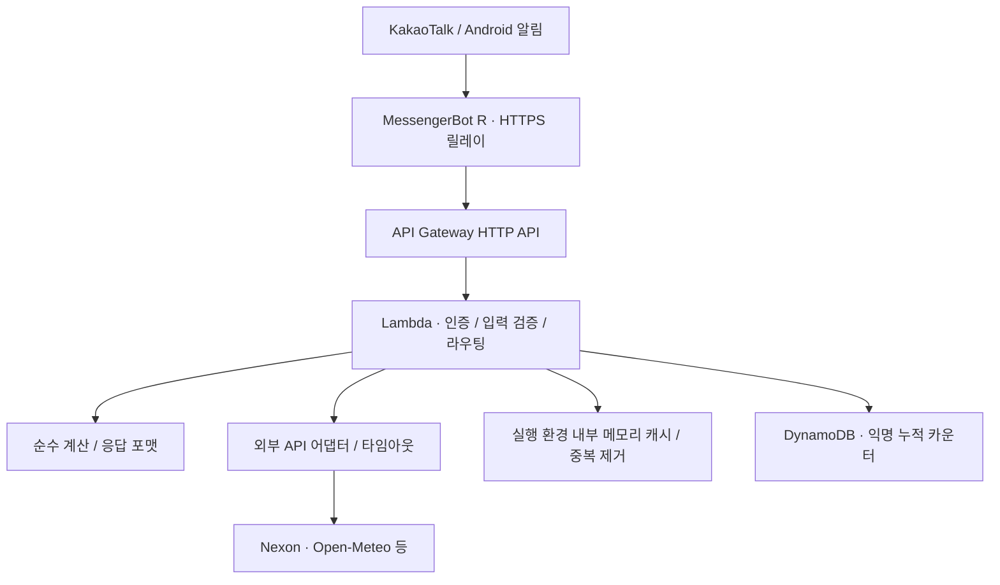

# Kakao Maple Bot

[日本語・採用担当者向け](README.ja.md) · [English](README.en.md)

[](https://github.com/ekseh93/kakao-maple-bot/actions/workflows/checks.yml)

> 제한된 그룹 채팅의 정보 조회·계산을 자동화하고, 사용자 피드백으로 개선해 온 AWS 서버리스 챗봇입니다.

`TypeScript` · `AWS Lambda` · `API Gateway` · `DynamoDB` · `Terraform` · `Vitest` · `GitHub Actions`

## 30초 소개

Android 공기계는 메시지를 HTTPS로 전달하고 응답을 나누어 보내는 릴레이입니다. 명령 해석, 입력 검증, 외부 API 호출, 계산과 오류 처리는 백엔드에서 수행합니다. 사용자 확인으로 실제 그룹 채팅 사용 이력이 있으며, 단말 재부팅·네트워크 복구를 포함한 장시간 검증은 별도 미완료 항목으로 관리합니다.

개인 비상업 프로젝트이며 개발에 AI 지원 도구를 사용했습니다. 요구사항과 운영 피드백, 생성된 코드, 자동 테스트와 배포 관측 기록을 구분합니다. 이 저장소는 AI 도움 없이 전체 코드를 직접 구현했다거나 팀 개발 경력이 있음을 주장하는 자료가 아닙니다.

처음 보시는 분은 [일본어 기술 사례 3개](docs/22-engineering-case-studies.ja.md), [실제 CodeRabbit 리뷰와 수정 PR #9](https://github.com/ekseh93/kakao-maple-bot/pull/9), [검증 범위](docs/23-portfolio-verification.md) 순서로 읽으면 됩니다.

[익명 통계 가상 샘플 시각화](docs/assets/command-usage-sample.svg)

위 차트는 실제 운영 데이터가 아닌 고정 샘플입니다. 집계 필드와 개인정보 보호 범위는 [통계 문서](docs/portfolio/command-usage.md)에서 확인할 수 있습니다.

## 아키텍처와 경계



- 외부 API 키는 백엔드에 둡니다. 공기계에는 백엔드 인증용 공유 시크릿이 필요하며 Git에 저장하지 않습니다.
- 캐시·속도 제한·중복 제거 상태는 Lambda 실행 환경 내부에 있습니다. 재시작·동시 인스턴스 사이의 공유나 지속성을 보장하지 않습니다.
- DynamoDB에는 누적 숫자와 갱신 시각을 저장합니다. 원문 대화·방 이름·발신자명을 저장하는 데이터베이스가 아닙니다.
- API 계약과 도메인 로직을 분리했지만, 다른 메신저로의 실제 이식은 검증하지 않았습니다.

[상세 아키텍처](docs/03-architecture.md) · [설계 결정 ADR](docs/decisions/README.md)

[익명 통계 운영 관측 런북](docs/24-observability-runbook.md)

## 설명할 수 있는 기술적 판단

| 문제                                        | 선택과 이유                                                        | 근거                                                                                                    |
| ------------------------------------------- | ------------------------------------------------------------------ | ------------------------------------------------------------------------------------------------------- |
| 외부 조회 한 곳이 실패하면 전체 결과도 실패 | 대기질은 선택 정보로 처리하고 1.2초 안에 본문까지 읽지 못하면 생략 | [공급자 코드](packages/providers/src/index.ts), [회귀 테스트](tests/providers.test.ts)                  |
| 사용자 계산식을 코드로 실행할 위험          | 토크나이저와 재귀 하강 파서로 허용된 산술만 계산                   | [계산기](packages/core/src/calculator.ts), [core 테스트](tests/core.test.ts)                            |
| CI 비밀정보 검사의 오탐                     | placeholder와 설정 참조를 구분하고 오류에는 파일·줄·규칙만 출력    | [검사기](scripts/secret-check-core.mjs), [리뷰 대응](https://github.com/ekseh93/kakao-maple-bot/pull/9) |
| 긴 응답이 모바일에서 잘림                   | 백엔드는 전체 장비 결과를 만들고 릴레이가 메시지를 분할            | [공기계 스크립트](apps/phone-relay/bot.js)                                                              |

## 개발·검증 흐름

`Issue → 짧은 작업 브랜치 → PR → CI / CodeRabbit → 지적 검토·수정 → main`

CI는 품질, 보안, 테스트·빌드를 독립 실행하고 모두 성공해야 `verify`가 통과합니다. CodeRabbit의 일본어 리뷰는 보조 수단이며 지적을 검증한 이유와 수정 결과를 PR에 남깁니다. 혼자 운영하는 프로젝트의 변경 관리이며 팀 협업 실적으로 표현하지 않습니다.

- [Issue #8 → PR #9: 실제 리뷰·수정 사례](https://github.com/ekseh93/kakao-maple-bot/pull/9)
- [Issue #10: 후속 변경 통합과 검증 개선](https://github.com/ekseh93/kakao-maple-bot/issues/10)
- [브랜치·리뷰 운영 규칙](docs/21-development-workflow.md)
- [트러블슈팅](docs/13-troubleshooting.md) · [변경 기록](docs/14-change-log.md)

배포는 병합과 별개입니다. 명시적으로 승인된 배포만 수행하고 대상 커밋, 관측 시각, API 결과를 기록합니다. 이 문서 개편으로 AWS나 공기계를 갱신했다고 주장하지 않습니다.

## 대표 기능

| 분류           | 예시                                        | 구현 관점                                |
| -------------- | ------------------------------------------- | ---------------------------------------- |
| 캐릭터·장비    | `!정보 닉네임`, `!장비 닉네임`              | 공식 API, 응답 검증, 잠재 옵션 합산·정렬 |
| 성장·수익 계산 | `!사우나 닉네임`, `!보스수익 검마 하드 2인` | 정적 데이터, API 갱신 시차, 경계값 검증  |
| 일반 계산      | `!계산기 25.3억 2명 5퍼`                    | 단위·수수료·균등 분배                    |
| 생활 정보      | `!날씨 도쿄`, `!환율`, `!주유소 서울`       | 타임아웃, 캐시, 부분 실패                |
| 공지·미니게임  | `!썬데이`, `!시드링`, `!부티크`             | 공지 중복 처리, 공식 확률표 해석         |
| PC 조회        | `!다나와견적`, `!다나와가격비교`            | 별도 인증 어댑터와 외부 프로세스 경계    |
| 운영           | `!통계`, `!상태`                            | 관리자 제한, 익명 집계                   |

전체 입력 계약과 제약은 [명령어 명세](docs/04-command-specification.md)에 있습니다. `!명령어 도움말`과 `!다나와 도움말`로 사용법을 확인할 수 있습니다.

## 사용 화면과 증거


이미지는 편집된 설명 자료이며 정확한 API 출력의 1차 증거가 아닙니다. 영문·일문 이미지는 번역·단순화한 자료입니다. [공개 범위](docs/17-portfolio-evidence.md)

테스트 수·성능·배포 상태는 반드시 대상 버전과 함께 읽어야 합니다. 현재 검수의 로컬 결과와 과거 AWS 기록, 사용자 기기 확인을 [검증 기록](docs/23-portfolio-verification.md)에서 구분합니다. p95 성능과 가용성 목표를 측정된 실적으로 표시하지 않습니다.

## 로컬 실행

Node.js 22, pnpm 11.19.0. 실제 API 키 없이 fixture 기반 검증이 가능합니다.

```sh
pnpm install --frozen-lockfile --ignore-scripts
pnpm format:check
pnpm lint
pnpm phone:check
pnpm pc-deals:check
pnpm policy:check
pnpm secret:test
pnpm secret:check
pnpm audit
pnpm typecheck
pnpm test
pnpm lambda:dry-run
```

설정 이름은 [.env.example](.env.example), 인프라는 [Terraform 안내](infra/terraform/README.md)를 참고하세요. 허용 방은 기본적으로 비어 있습니다.

## 문서와 한계

- [요구사항](docs/02-requirements.md) · [보안·운영](docs/06-security-operations.md) · [테스트 전략](docs/07-test-strategy.md)
- [API·데이터 정책](docs/05-api-data-policy.md) · [공기계 E2E 체크리스트](docs/16-phone-e2e-checklist.md)
- 공식 Kakao 챗봇 연동이 아닌 일반 계정 릴레이이므로 계정·알림·단말 환경에 따른 제약이 있습니다.
- 무료 한도는 비용 0원을 보장하지 않습니다. 상용 SLA, 분산 중복 제거, 24시간 안정성 달성을 주장하지 않습니다.
- 외부 HTML 공급자는 구조 변경·접근 제한으로 실패할 수 있습니다. Maple.GG·Maplescouter는 링크 전용입니다.
- 주식은 조회 전용입니다. 거래·수익 보장 기능은 없습니다.
- 별도 라이선스는 부여하지 않았습니다. 개인 비상업 포트폴리오 공개가 재배포·상업 이용 허락을 의미하지 않습니다.
