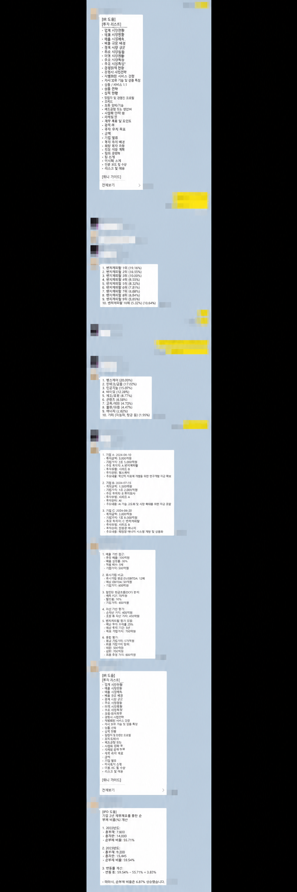

# Kakao Maple Bot

> 공기계 카카오톡을 AWS 서버리스 백엔드와 연결해, 실제 그룹 채팅에서 반복되는 정보 조회와 계산을 자동화한 개인 프로젝트입니다.

[日本語](README.ja.md) · [English](README.en.md)

`TypeScript` · `AWS Lambda` · `API Gateway` · `DynamoDB` · `Terraform` · `Nexon Open API` · `Vitest`

## 프로젝트 한눈에 보기

| 항목      | 내용                                                                            |
| --------- | ------------------------------------------------------------------------------- |
| 개발 기간 | 2026.08 ~ 현재                                                                  |
| 형태      | 개인 개발·운영, 비상업 포트폴리오                                               |
| 담당 범위 | 요구사항 정의, 아키텍처 설계, TypeScript 구현, IaC, 테스트, AWS 배포, 운영 개선 |
| 사용 환경 | 지인이 참여하는 제한된 KakaoTalk 그룹 채팅                                      |
| 현재 상태 | 도쿄 리전 배포 및 백엔드 smoke test 완료, 실제 공기계 사용은 사용자 확인        |
| 품질 기준 | 자동 테스트 181건, strict typecheck, lint, 정책 검사, phone script 검사         |

이 프로젝트는 기능 수를 늘리는 데서 끝내지 않고, **정책 위험이 있는 비공식 메신저 연동을 어떻게 안전하게 분리하고 실제로 운영할 것인가**를 중심으로 설계했습니다. AI 지원 도구를 개발 과정에 활용했으며, 변경 내용은 공식 문서·코드 검토·자동 테스트·배포 후 smoke test로 다시 확인합니다.

## 해결하려고 한 문제

메이플스토리 이용자는 캐릭터 정보, 심볼 강화 비용, 보스 수익, 이벤트 공지를 확인하기 위해 여러 사이트와 계산기를 반복해서 오가야 합니다. 그룹 채팅에서는 메뉴 선택이나 간단한 게임처럼 즉시 결정하고 싶은 상황도 자주 생깁니다.

이를 다음과 같이 해결했습니다.

- 카카오톡에서 짧은 명령 한 번으로 조회·계산 결과를 확인합니다.
- Android 공기계는 메시지 전달만 담당하고, 비즈니스 로직과 비밀정보는 AWS 백엔드에 둡니다.
- 메이플 데이터는 Nexon Open API, 계산 기능은 버전 관리된 프로젝트 자체 로직을 사용합니다.
- 외부 공급자 장애가 다른 명령으로 번지지 않도록 timeout, cache, retry, stale fallback을 분리합니다.
- 대화 원문·방 이름·발신자 정보를 저장하지 않고 익명 누적 통계만 관리합니다.

## 아키텍처

```text
KakaoTalk
    ↕ Android notification / reply
MessengerBot R v40 on a spare phone
    ↕ HTTPS + Bearer secret
Amazon API Gateway HTTP API
    ↓
AWS Lambda (Node.js 22 / TypeScript)
    ├─ 인증 · 허용 방 · rate limit · 중복 이벤트 방지
    ├─ command router / formatter
    ├─ Nexon Open API adapter
    ├─ 외부 읽기 전용 provider adapters
    ├─ 계산기 · 정적 데이터 · 랜덤 기능
    └─ 익명 통계 ─ DynamoDB (Tokyo)
```

공기계 스크립트를 얇은 릴레이로 제한해 기기를 교체해도 HTTP 계약과 백엔드 로직을 재사용할 수 있습니다. 계산·외부 API·캐시·인증을 Lambda에 모아 로컬에서 자동 검증할 수 있도록 했습니다.

자세한 설계는 [시스템 아키텍처](docs/03-architecture.md)와 [ADR](docs/decisions/README.md)에 기록했습니다.

## 핵심 구현과 판단

### 1. 공식 데이터 우선과 외부 서비스 경계

- 캐릭터·무릉·유니온·장비·경험치는 Nexon Open API에서 직접 조회합니다.
- Maple.GG와 Maplescouter는 사용자에게 링크만 제공하며 크롤링하거나 비공개 API를 사용하지 않습니다.
- 심볼·보스 수익 계산은 출처와 기준일을 가진 정적 데이터와 순수 함수로 구현했습니다.

### 2. 안전한 계산기

`!계산기 25.3억 2명 5퍼`처럼 게임에서 자연스럽게 사용하는 한국어 입력을 지원합니다. `eval`이나 `Function`을 사용하지 않고 전용 토크나이저와 재귀 하강 파서로 사칙연산·단위·수수료·n빵을 계산합니다.

### 3. 장애 격리와 모바일 응답 설계

- 공급자별 timeout·cache·retry를 독립 적용해 한 서비스의 장애가 전체 봇을 막지 않게 했습니다.
- 공개 게시판의 일시 장애에는 허용된 범위에서 최근 정상 결과를 사용하고, 접근제어 우회는 하지 않습니다.
- 긴 장비 결과는 백엔드에서 정보를 자르지 않고 공기계 릴레이가 카카오톡 길이에 맞춰 나눠 전송합니다.

### 4. 보안과 개인정보 최소화

- 기본 거부 방식의 허용 방 목록, Bearer secret, kill switch, rate limit, event ID TTL을 적용했습니다.
- API 키·shared secret·실제 방 이름은 Git 밖에서 주입합니다.
- CloudWatch에는 명령 종류·결과·응답시간만 기록하며 대화 원문과 사용자 식별자는 저장하지 않습니다.
- `!통계`는 DynamoDB의 단일 `TOTAL` 항목만 갱신합니다.

### 5. 재현 가능한 AWS 운영

초기 Cloudflare Worker 설계에서 취업 목표와 운영 경험을 고려해 AWS Lambda + API Gateway로 전환했습니다. Terraform으로 도쿄 리전만 허용하고, 최소 권한 IAM·암호화 DynamoDB·Lambda 환경 구성을 코드로 관리합니다.

## 대표 기능

| 분류        | 명령 예시                                        | 구현 포인트                                      |
| ----------- | ------------------------------------------------ | ------------------------------------------------ |
| 캐릭터 조회 | `!정보 닉네임`, `!장비 닉네임`                   | Nexon API 응답 검증, 부분 실패 처리, 모바일 포맷 |
| 성장 계산   | `!심볼 기어드락 1 11`, `!사우나 닉네임`          | 버전 관리된 데이터와 경계값 테스트               |
| 보스 계산   | `!보스수익 검마 하드 2인 / 세렌 노말 3인`        | 주간·월간 구분, 인원 검증, 소수점 버림           |
| 일반 계산   | `!계산기 12퍼 x 11개`, `!계산기 25.3억 2명 5퍼`  | 코드 평가 없는 전용 파서                         |
| PC 견적     | `!견적 100만원 게이밍`, `!견적 200만원 영상편집` | 예산·용도 정규화, 가격/호환성 Adapter 경계       |
| 공지·이벤트 | `!공지`, `!이벤트`, `!썬데이`                    | 공식 데이터, 캐시, 키워드 알림                   |
| 생활 정보   | `!날씨 도쿄`, `!환율`, `!주유소 서울`            | 읽기 전용 provider와 오류 격리                   |
| 채팅 기능   | `!짜장vs짬뽕`, `!뭐먹지`, `!로또`                | 외부 호출 없는 순수 로직                         |
| 주식 시세   | `!주식 삼성전자`, `!주식 Tesla`                  | 조회 전용, 주문·계좌 기능 제외                   |

전체 명령과 입력·오류 계약은 [명령어 명세](docs/04-command-specification.md)에서 확인할 수 있습니다.

## 사용자 피드백에서 기능으로 연결한 사례

2026-09-01 제한된 채팅방에서 “가격대별 컴퓨터 견적 추천” 문의가 들어왔습니다. 사용자는 다나와 PC의 가격대별 추천 견적과 유사하게, 예산과 용도에 맞는 부품 목록·예상 합계를 카카오톡에서 바로 확인하기를 원했습니다. 이 피드백을 바탕으로 `!견적 <예산> <용도> [모니터포함]` 명령어와 최대 3개 후보 출력, 별도 PC 가격 Adapter 경계를 설계했습니다. 원본 대화 이미지의 참여자·방 식별정보는 저장하지 않고 요구사항과 검증 결과만 기록했습니다. 자세한 QA 기록은 [트러블슈팅 기록](docs/13-troubleshooting.md)에 있습니다.

## 검증 가능한 결과

| 검증 항목       | 확인된 결과                                             | 증거                                            |
| --------------- | ------------------------------------------------------- | ----------------------------------------------- |
| 자동 테스트     | **181 passed** (`core 63`, `providers 50`, `lambda 68`) | `pnpm test`                                     |
| 정적 품질       | strict typecheck, ESLint, Prettier, policy check 통과   | [로컬 검증 기록](docs/10-local-verification.md) |
| 공기계 스크립트 | MessengerBot R용 JavaScript 구문 검사                   | `pnpm phone:check`                              |
| AWS 배포        | `ap-northeast-1` Lambda/API Gateway, `/health` HTTP 200 | [출시 승인 게이트](docs/12-release-gate.md)     |
| 배포 API        | 인증된 `/v1/messages`의 도움말·보스 수익 응답 확인      | [로컬 검증 기록](docs/10-local-verification.md) |
| 실제 Kakao 사용 | 제한된 그룹 채팅에서 사용 중                            | 사용자 확인, 독립 Android E2E는 미관측          |

`/health`가 정상이라는 사실만으로 카카오톡 전체 흐름을 검증했다고 주장하지 않습니다. 저장소 자동 검증, AWS에서 관측한 결과, 사용자 기기 확인을 구분해 기록했습니다.

## 사용 화면

<p align="center">
  
</p>

실제 대화 상대·방 이름·아바타·시각·URL은 공개하지 않습니다. 위 이미지는 기능 흐름을 보여주는 비식별화 파생 자료이며, 정확한 데이터와 배포 상태의 1차 증거는 아닙니다. [공개 범위와 증거 기준](docs/17-portfolio-evidence.md)

## 기술 스택

| 영역           | 기술                                                                          |
| -------------- | ----------------------------------------------------------------------------- |
| Backend        | TypeScript 5, Node.js 22, AWS Lambda                                          |
| API / State    | API Gateway HTTP API, DynamoDB                                                |
| Infrastructure | Terraform, CloudFormation, IAM Identity Center                                |
| External data  | Nexon Open API, Open-Meteo, TMDB, Yahoo Finance, Tiingo 등 읽기 전용 provider |
| Quality        | Vitest, TypeScript strict, ESLint, Prettier, dependency audit, policy check   |
| Device relay   | MessengerBot R v40, JavaScript                                                |

## 저장소 구조

```text
apps/
  lambda/        AWS Lambda HTTP boundary
  phone-relay/   MessengerBot R thin relay
packages/
  core/          command, parser, calculator, formatter
  providers/     external API adapters and schemas
infra/terraform/ AWS infrastructure as code
tests/           unit, provider contract, Lambda integration tests
docs/            requirements, architecture, policy, operations, evidence
```

## 로컬 실행과 검증

Node.js 22와 pnpm 11을 사용합니다. 실제 API 키 없이도 mock 기반 자동 테스트를 실행할 수 있습니다.

```powershell
pnpm install --ignore-scripts
pnpm typecheck
pnpm test
pnpm lint
pnpm build
pnpm lambda:dry-run
pnpm format:check
pnpm policy:check
pnpm phone:check
pnpm audit
```

환경 변수 이름은 [.env.example](.env.example)에만 정의되어 있고 값은 비워 두었습니다. 기본 허용 방 목록도 비어 있어 별도 설정 없이는 메시지에 응답하지 않습니다.

AWS 배포는 명시적 승인과 유효한 IAM Identity Center 인증을 전제로 합니다. 세부 절차는 [Terraform 운영 문서](infra/terraform/README.md)와 [출시 승인 게이트](docs/12-release-gate.md)를 참고하세요.

## 문서화

- [제품 요구사항](docs/01-product-requirements.md) · [기능·비기능 요구사항](docs/02-requirements.md)
- [시스템 아키텍처](docs/03-architecture.md) · [명령어 명세](docs/04-command-specification.md)
- [API·데이터·저작권 정책](docs/05-api-data-policy.md) · [보안·운영 설계](docs/06-security-operations.md)
- [테스트 전략](docs/07-test-strategy.md) · [요구사항 추적성](docs/11-traceability.md)
- [트러블슈팅](docs/13-troubleshooting.md) · [변경 기록](docs/14-change-log.md)
- [PC 견적 명세](docs/18-pc-quote.md)
- [PC 견적 Adapter](apps/pc-deals-adapter/README.md)
- [공기계 E2E 체크리스트](docs/16-phone-e2e-checklist.md) · [포트폴리오 증거 기준](docs/17-portfolio-evidence.md)

## 한계와 운영 원칙

- 일반 KakaoTalk 계정 자동화는 공식 챗봇 방식이 아니며 계정 제한 가능성이 있습니다.
- 무료 한도는 비용 0원을 보장하지 않으므로 AWS Budget과 사용량 감시가 필요합니다.
- 공개 HTML 기반 공급자는 응답 구조 변경이나 접근 제한으로 일시 실패할 수 있습니다.
- PC 견적 공급자는 별도 Adapter로 격리하며, 가격 결과는 조회 시각·출처를 함께 표시합니다.
- 실제 Android 24시간 soak test와 재부팅·네트워크 복구의 독립 검증은 남아 있습니다.
- 주식 기능은 정보 제공만 하며 거래·추천·수익 보장 기능이 없습니다.

## 라이선스

별도 라이선스를 부여하지 않았습니다. 현재 저장소는 개인·비상업 포트폴리오 공개용이며, 복제·배포·상업적 이용 권한을 허용하지 않습니다.
